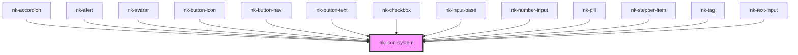

# nk-icon-system

<!-- Auto Generated Below -->

## Properties

| Property  | Attribute | Description                                        | Type     | Default     |
| --------- | --------- | -------------------------------------------------- | -------- | ----------- |
| `name`    | `name`    | The name of the icon, e.g. 'add', 'remove', 'lock' | `string` | `undefined` |
| `size`    | `size`    | The size category of the icon                      | `string` | `undefined` |
| `variant` | `variant` | Icon variant determining color and size            | `string` | `undefined` |

## Dependencies

### Used by

 - [nk-accordion](../accordionItem)
 - [nk-alert](../alert)
 - [nk-avatar](../avatar)
 - [nk-button-icon](../iconButton)
 - [nk-button-nav](../navigationButton)
 - [nk-button-text](../button)
 - [nk-checkbox](../checkbox)
 - [nk-input-base](../inputBase)
 - [nk-number-input](../numberInput)
 - [nk-pill](../pill)
 - [nk-stepper-item](../flowStepperItem)
 - [nk-tag](../tag)
 - [nk-text-input](../textInput)

### Graph

----------------------------------------------

*Built with [StencilJS](https://stenciljs.com/)*
