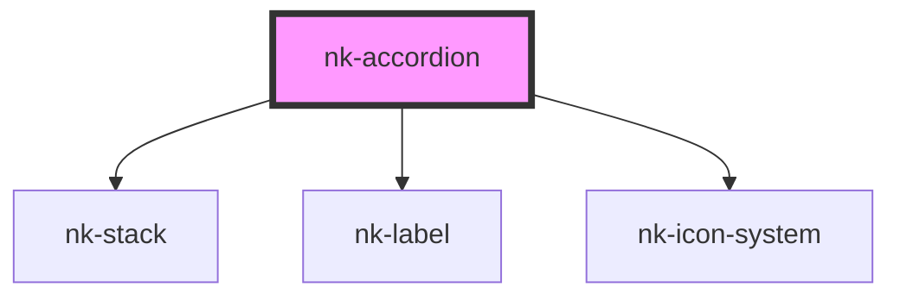

# nk-accordion

<!-- Auto Generated Below -->

## Properties

| Property  | Attribute | Description                       | Type                          | Default     |
| --------- | --------- | --------------------------------- | ----------------------------- | ----------- |
| `isopen`  | `isopen`  |                                   | `boolean`                     | `false`     |
| `text`    | `text`    | The title of the accordion item   | `string`                      | `''`        |
| `variant` | `variant` | The variant of the accordion item | `"default" \| "icon-heading"` | `'default'` |

## Dependencies

### Depends on

- [nk-stack](../stack)
- [nk-label](../label)
- [nk-icon-system](../Icon)

### Graph

----------------------------------------------

*Built with [StencilJS](https://stenciljs.com/)*
