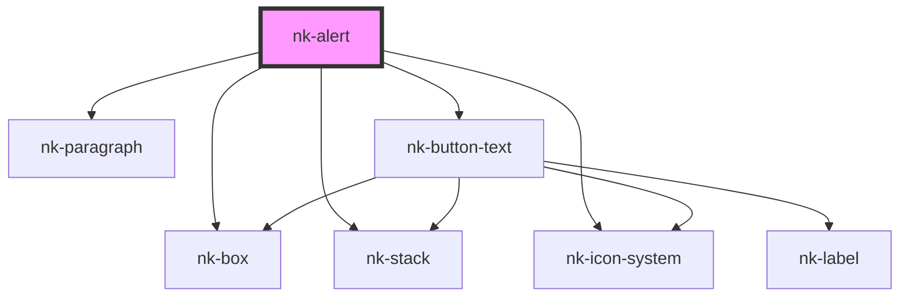

# nk-alert

<!-- Auto Generated Below -->

## Properties

| Property      | Attribute      | Description                             | Type                 | Default   |
| ------------- | -------------- | --------------------------------------- | -------------------- | --------- |
| `buttonLabel` | `button-label` | The text inside the button to the right | `string`             | `''`      |
| `icon`        | `icon`         | The icon displayed to the left          | `string`             | `''`      |
| `text`        | `text`         | The text displayed inside the alert     | `string`             | `''`      |
| `variant`     | `variant`      | description                             | `"major" \| "minor"` | `'major'` |

## Events

| Event           | Description | Type                      |
| --------------- | ----------- | ------------------------- |
| `buttonClicked` |             | `CustomEvent<MouseEvent>` |

## Dependencies

### Depends on

- [nk-box](../box)
- [nk-stack](../stack)
- [nk-icon-system](../Icon)
- [nk-paragraph](../paragraph)
- [nk-button-text](../button)

### Graph

----------------------------------------------

*Built with [StencilJS](https://stenciljs.com/)*
