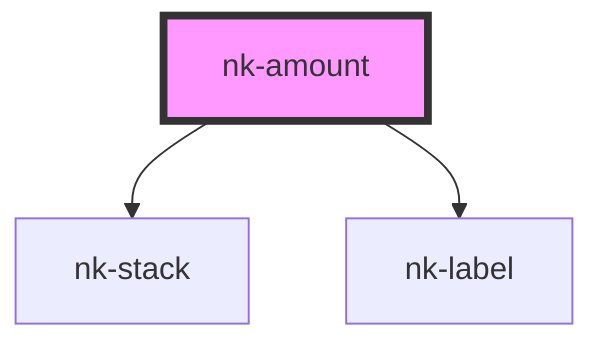

# nk-amount

<!-- Auto Generated Below -->

## Properties

| Property    | Attribute   | Description                                  | Type                             | Default     |
| ----------- | ----------- | -------------------------------------------- | -------------------------------- | ----------- |
| `alignment` | `alignment` | Alignment of the label above                 | `"left" \| "right"`              | `'left'`    |
| `price`     | `price`     | The price that is displayed                  | `string`                         | `undefined` |
| `rate`      | `rate`      | The rate that is displayed next to the price | `string`                         | `undefined` |
| `text`      | `text`      | The text for the label above                 | `string`                         | `undefined` |
| `variant`   | `variant`   | Variant of the amount component              | `"large" \| "medium" \| "small"` | `'large'`   |

## Dependencies

### Depends on

- [nk-stack](../stack)
- [nk-label](../label)

### Graph

----------------------------------------------

*Built with [StencilJS](https://stenciljs.com/)*
