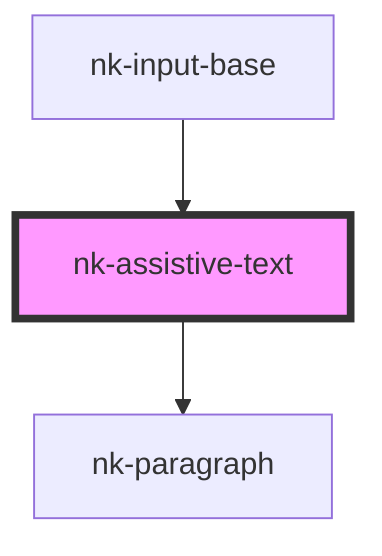

# nk-assistive-text

<!-- Auto Generated Below -->

## Properties

| Property  | Attribute | Description                                              | Type                | Default     |
| --------- | --------- | -------------------------------------------------------- | ------------------- | ----------- |
| `label`   | `label`   | The label displayed inside of the div                    | `string`            | `undefined` |
| `variant` | `variant` | The variant of the button, such as primary and secondary | `"error" \| "info"` | `'error'`   |

## Dependencies

### Used by

 - [nk-input-base](../inputBase)

### Depends on

- [nk-paragraph](../paragraph)

### Graph

----------------------------------------------

*Built with [StencilJS](https://stenciljs.com/)*
