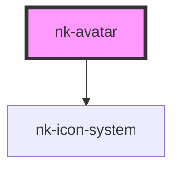

# nk-avatar

<!-- Auto Generated Below -->

## Properties

| Property   | Attribute   | Description                                                             | Type     | Default       |
| ---------- | ----------- | ----------------------------------------------------------------------- | -------- | ------------- |
| `iconName` | `icon-name` | The icon to be shown if no image src is provided or image loading fails | `string` | `'circle-10'` |
| `src`      | `src`       | The source/path to the image shown in the avatar                        | `string` | `undefined`   |

## Dependencies

### Depends on

- [nk-icon-system](../Icon)

### Graph

----------------------------------------------

*Built with [StencilJS](https://stenciljs.com/)*
