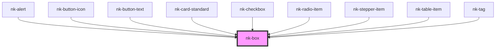

# nk-elevation

<!-- Auto Generated Below -->

## Properties

| Property  | Attribute | Description           | Type     | Default     |
| --------- | --------- | --------------------- | -------- | ----------- |
| `variant` | `variant` | The elevation variant | `string` | `undefined` |

## Dependencies

### Used by

 - [nk-alert](../alert)
 - [nk-button-icon](../iconButton)
 - [nk-button-text](../button)
 - [nk-card-standard](../card)
 - [nk-checkbox](../checkbox)
 - [nk-radio-item](../radioDetailed)
 - [nk-stepper-item](../flowStepperItem)
 - [nk-table-item](../dataDefinitionItem)
 - [nk-tag](../tag)

### Graph

----------------------------------------------

*Built with [StencilJS](https://stenciljs.com/)*
