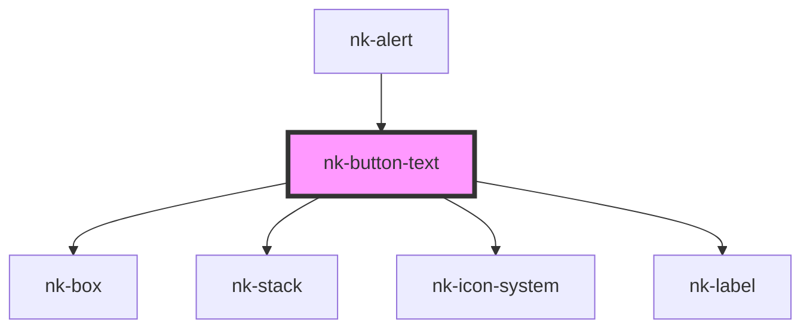

# nk-button

<!-- Auto Generated Below -->

## Properties

| Property       | Attribute      | Description                                               | Type      | Default     |
| -------------- | -------------- | --------------------------------------------------------- | --------- | ----------- |
| `disabled`     | `disabled`     | Is this button disabled?                                  | `boolean` | `undefined` |
| `label`        | `label`        | The label displayed inside of the button and as a tooltip | `string`  | `undefined` |
| `leadingicon`  | `leadingicon`  | icon preceding the label                                  | `string`  | `undefined` |
| `trailingicon` | `trailingicon` | icon following the label                                  | `string`  | `undefined` |
| `variant`      | `variant`      | The variant of the button, such as primary and secondary  | `string`  | `'primary'` |

## Dependencies

### Used by

 - [nk-alert](../alert)

### Depends on

- [nk-box](../box)
- [nk-stack](../stack)
- [nk-icon-system](../Icon)
- [nk-label](../label)

### Graph

----------------------------------------------

*Built with [StencilJS](https://stenciljs.com/)*
