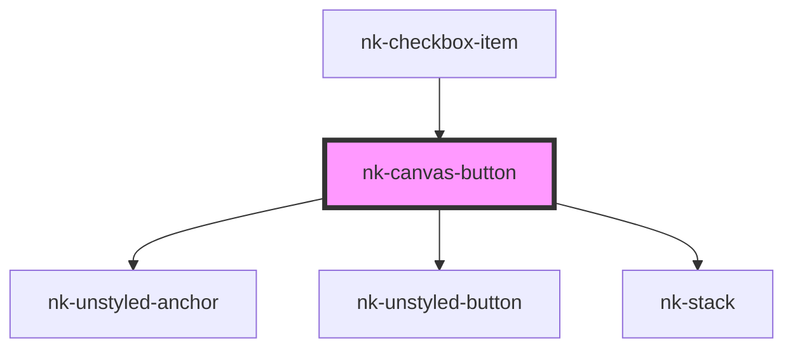

# nk-canvas-button

<!-- Auto Generated Below -->

## Properties

| Property    | Attribute   | Description                                                                            | Type                            | Default     |
| ----------- | ----------- | -------------------------------------------------------------------------------------- | ------------------------------- | ----------- |
| `alignment` | `alignment` | Controls the horizontal alignment of the nested content                                | `"center" \| "left" \| "right"` | `'center'`  |
| `disabled`  | `disabled`  | Determines if the button is disabled                                                   | `boolean`                       | `false`     |
| `href`      | `href`      | Href for the link                                                                      | `string`                        | `''`        |
| `isactive`  | `isactive`  | Used to change the look of the canvas button, depending on whether it is active or not | `boolean`                       | `false`     |
| `type`      | `type`      | The type of the canvas button                                                          | `"action" \| "anchor"`          | `'action'`  |
| `variant`   | `variant`   | Variant of the canvas button                                                           | `"default"`                     | `'default'` |

## Dependencies

### Used by

 - [nk-checkbox-item](../checkboxDetailed)

### Depends on

- [nk-unstyled-anchor](../unstyledAnchor)
- [nk-unstyled-button](../unstyledButton)
- [nk-stack](../stack)

### Graph

----------------------------------------------

*Built with [StencilJS](https://stenciljs.com/)*
