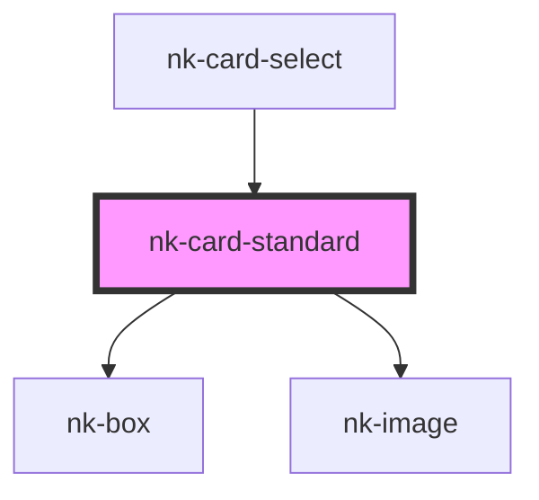

# nk-card

<!-- Auto Generated Below -->

## Properties

| Property       | Attribute      | Description               | Type                               | Default     |
| -------------- | -------------- | ------------------------- | ---------------------------------- | ----------- |
| `imagealttext` | `imagealttext` |                           | `string`                           | `undefined` |
| `imageurl`     | `imageurl`     | The image URL of the card | `string`                           | `undefined` |
| `variant`      | `variant`      | The card variant          | `"default" \| "flex" \| "inherit"` | `'default'` |

## Dependencies

### Used by

 - [nk-card-select](../cardSelect)

### Depends on

- [nk-box](../box)
- [nk-image](../image)

### Graph

----------------------------------------------

*Built with [StencilJS](https://stenciljs.com/)*
