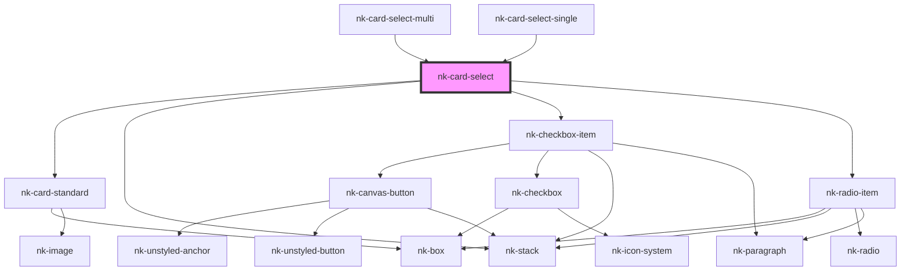

# nk-card-select

<!-- Auto Generated Below -->

## Properties

| Property       | Attribute      | Description                                   | Type                    | Default      |
| -------------- | -------------- | --------------------------------------------- | ----------------------- | ------------ |
| `actionlabel`  | `actionlabel`  | Label to the action at the bottom of the card | `string`                | `''`         |
| `actiontitle`  | `actiontitle`  | Title of the action at the bottom of the card | `string`                | `''`         |
| `actionvalue`  | `actionvalue`  | Value of the action                           | `boolean`               | `false`      |
| `cardid`       | `cardid`       | Unique id of the card                         | `string`                | `''`         |
| `imagealttext` | `imagealttext` | Alt text to the image                         | `string`                | `''`         |
| `imageurl`     | `imageurl`     | Url of the image                              | `string`                | `''`         |
| `variant`      | `variant`      | Variant of the card select                    | `"checkbox" \| "radio"` | `'checkbox'` |

## Events

| Event         | Description | Type                   |
| ------------- | ----------- | ---------------------- |
| `cardChanged` |             | `CustomEvent<boolean>` |

## Dependencies

### Used by

 - [nk-card-select-multi](../multiSelectCardItem)
 - [nk-card-select-single](../singleSelectCardItem)

### Depends on

- [nk-card-standard](../card)
- [nk-stack](../stack)
- [nk-checkbox-item](../checkboxDetailed)
- [nk-radio-item](../radioDetailed)

### Graph

----------------------------------------------

*Built with [StencilJS](https://stenciljs.com/)*
