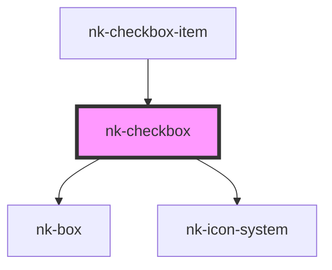

# nk-checkbox

<!-- Auto Generated Below -->

## Properties

| Property    | Attribute   | Description                                                     | Type      | Default     |
| ----------- | ----------- | --------------------------------------------------------------- | --------- | ----------- |
| `disabled`  | `disabled`  | Is this checkbox disabled?                                      | `boolean` | `undefined` |
| `hideinput` | `hideinput` | boolean to tell if input should be displayed in DOM or not      | `boolean` | `false`     |
| `value`     | `value`     | The value of the checkbox. True if checked, false if unchecked. | `boolean` | `false`     |

## Events

| Event          | Description | Type                   |
| -------------- | ----------- | ---------------------- |
| `valueChanged` |             | `CustomEvent<boolean>` |

## Dependencies

### Used by

 - [nk-checkbox-item](../checkboxDetailed)

### Depends on

- [nk-box](../box)
- [nk-icon-system](../Icon)

### Graph

----------------------------------------------

*Built with [StencilJS](https://stenciljs.com/)*
