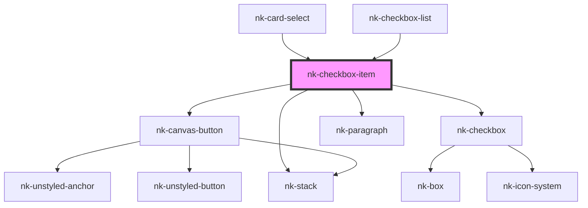

# nk-checkbox-with-label

<!-- Auto Generated Below -->

## Properties

| Property     | Attribute    | Description                                                     | Type      | Default     |
| ------------ | ------------ | --------------------------------------------------------------- | --------- | ----------- |
| `disabled`   | `disabled`   | Is this checkbox disabled?                                      | `boolean` | `false`     |
| `hideinput`  | `hideinput`  | Boolean to tell if input should be displayed in DOM or not      | `boolean` | `false`     |
| `label`      | `label`      | Label of the checkbox                                           | `string`  | `''`        |
| `titlelabel` | `titlelabel` | The emphasized text above the label                             | `string`  | `''`        |
| `value`      | `value`      | The value of the checkbox. True if checked, false if unchecked. | `boolean` | `false`     |
| `variant`    | `variant`    | The variant of the checkbox                                     | `string`  | `'default'` |

## Events

| Event          | Description | Type                   |
| -------------- | ----------- | ---------------------- |
| `valueChanged` |             | `CustomEvent<boolean>` |

## Dependencies

### Used by

 - [nk-card-select](../cardSelect)
 - [nk-checkbox-list](../checkboxDetailedList)

### Depends on

- [nk-canvas-button](../canvasButton)
- [nk-checkbox](../checkbox)
- [nk-stack](../stack)
- [nk-paragraph](../paragraph)

### Graph

----------------------------------------------

*Built with [StencilJS](https://stenciljs.com/)*
