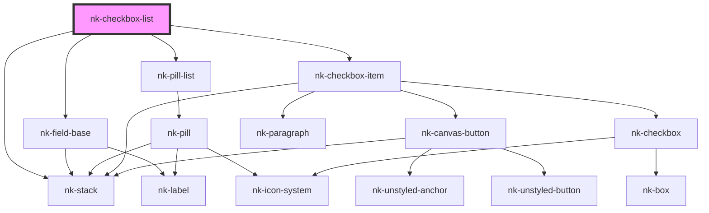

# nk-checkbox-with-label

<!-- Auto Generated Below -->

## Properties

| Property      | Attribute     | Description                                                       | Type                                            | Default      |
| ------------- | ------------- | ----------------------------------------------------------------- | ----------------------------------------------- | ------------ |
| `label`       | `label`       | Field label                                                       | `string`                                        | `undefined`  |
| `options`     | --            | available options                                                 | `CheckboxDetailedProps[]`                       | `[]`         |
| `orientation` | `orientation` | Orientation of the checkbox list. Defaults to vertical            | `"horizontal" \| "vertical"`                    | `'vertical'` |
| `values`      | --            | selected keys                                                     | `string[]`                                      | `[]`         |
| `variant`     | `variant`     | Checkbox variant. Should we show the list as pills or checkboxes? | `"canvas" \| "checkbox" \| "default" \| "pill"` | `'default'`  |

## Events

| Event           | Description | Type                    |
| --------------- | ----------- | ----------------------- |
| `valuesChanged` |             | `CustomEvent<string[]>` |

## Dependencies

### Depends on

- [nk-field-base](../fieldBase)
- [nk-pill-list](../pillList)
- [nk-stack](../stack)
- [nk-checkbox-item](../checkboxDetailed)

### Graph

----------------------------------------------

*Built with [StencilJS](https://stenciljs.com/)*
