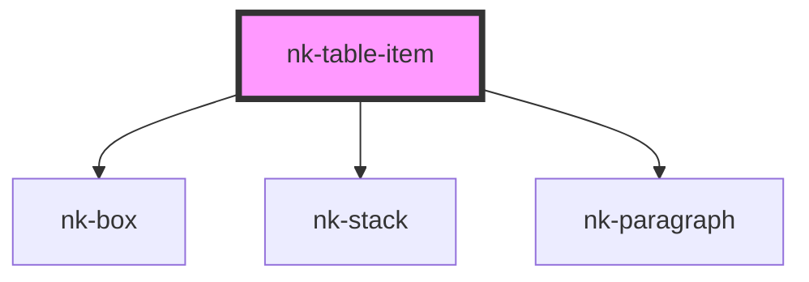

# nk-table-item

<!-- Auto Generated Below -->

## Properties

| Property  | Attribute | Description                      | Type     | Default     |
| --------- | --------- | -------------------------------- | -------- | ----------- |
| `label`   | `label`   | The label displayed to the left  | `string` | `''`        |
| `value`   | `value`   | The value displayed to the right | `string` | `''`        |
| `variant` | `variant` | Variant of the item              | `string` | `'default'` |

## Dependencies

### Depends on

- [nk-box](../box)
- [nk-stack](../stack)
- [nk-paragraph](../paragraph)

### Graph

----------------------------------------------

*Built with [StencilJS](https://stenciljs.com/)*
