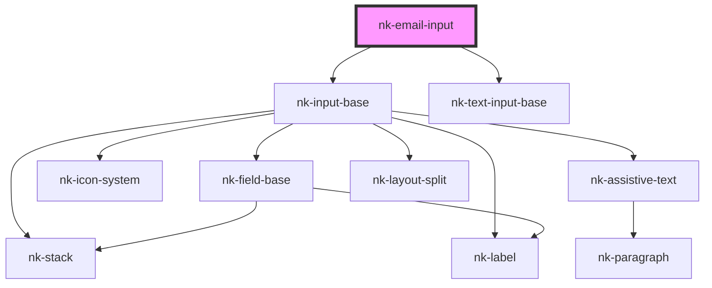

# nk-email-input

<!-- Auto Generated Below -->

## Properties

| Property         | Attribute        | Description                           | Type     | Default     |
| ---------------- | ---------------- | ------------------------------------- | -------- | ----------- |
| `label`          | `label`          | The label shown above the input field | `string` | `undefined` |
| `labelassistive` | `labelassistive` | Custom label to display under input   | `string` | `undefined` |
| `maxLength`      | `max-length`     | Max length of the input string        | `string` | `undefined` |
| `value`          | `value`          | The value of the input                | `string` | `''`        |
| `variant`        | `variant`        | The variant of the fieldBase element  | `string` | `'default'` |
| `width`          | `width`          | Width of the field in 'ch'            | `number` | `undefined` |

## Events

| Event          | Description | Type                  |
| -------------- | ----------- | --------------------- |
| `valueChanged` |             | `CustomEvent<string>` |

## Dependencies

### Depends on

- [nk-input-base](../inputBase)
- [nk-text-input-base](../textInputBase)

### Graph

----------------------------------------------

*Built with [StencilJS](https://stenciljs.com/)*
