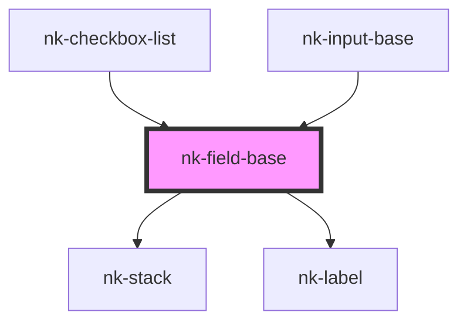

# nk-field-base

<!-- Auto Generated Below -->

## Properties

| Property         | Attribute        | Description                                                  | Type      | Default     |
| ---------------- | ---------------- | ------------------------------------------------------------ | --------- | ----------- |
| `hasValue`       | `has-value`      | Determines if the label should be raised                     | `boolean` | `undefined` |
| `label`          | `label`          | The label to render. This should be descriptive of the field | `string`  | `''`        |
| `labelassistive` | `labelassistive` | Assistive label which is placed below the component          | `string`  | `undefined` |
| `variant`        | `variant`        | The variant of the fieldBase element                         | `string`  | `'default'` |
| `width`          | `width`          | Width of the component in "ch"                               | `number`  | `undefined` |

## Dependencies

### Used by

 - [nk-checkbox-list](../checkboxDetailedList)
 - [nk-input-base](../inputBase)

### Depends on

- [nk-stack](../stack)
- [nk-label](../label)

### Graph

----------------------------------------------

*Built with [StencilJS](https://stenciljs.com/)*
