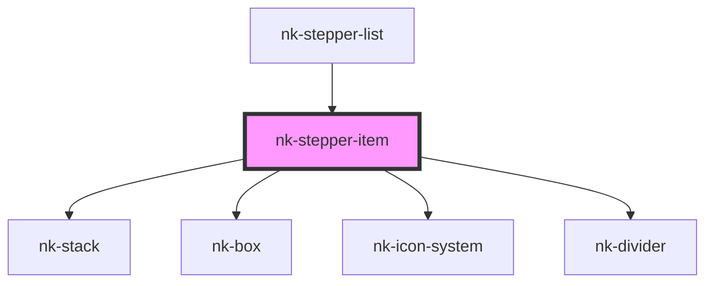

# nk-stepper-item

<!-- Auto Generated Below -->

## Properties

| Property      | Attribute     | Description                      | Type      | Default |
| ------------- | ------------- | -------------------------------- | --------- | ------- |
| `icon`        | `icon`        | Icon of the bar                  | `string`  | `''`    |
| `isactive`    | `isactive`    | If bar is active                 | `boolean` | `false` |
| `iscompleted` | `iscompleted` | If bar is completed              | `boolean` | `false` |
| `islastitem`  | `islastitem`  | Is it the last item in the steps | `boolean` | `false` |
| `label`       | `label`       | Label used for title on bar      | `string`  | `''`    |
| `stepperId`   | `stepper-id`  | Id of the item                   | `string`  | `''`    |

## Dependencies

### Used by

 - [nk-stepper-list](../flowStepperList)

### Depends on

- [nk-stack](../stack)
- [nk-box](../box)
- [nk-icon-system](../Icon)
- [nk-divider](../divider)

### Graph

----------------------------------------------

*Built with [StencilJS](https://stenciljs.com/)*
