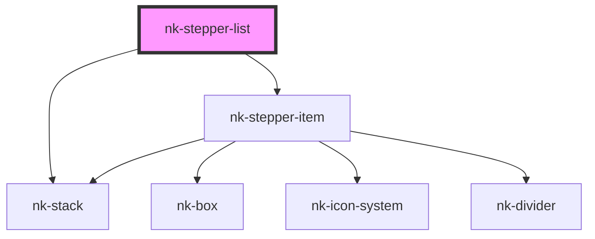

# nk-stepper-list

<!-- Auto Generated Below -->

## Properties

| Property      | Attribute     | Description                   | Type          | Default     |
| ------------- | ------------- | ----------------------------- | ------------- | ----------- |
| `currentstep` | `currentstep` | The current step of the steps | `string`      | `''`        |
| `steps`       | --            | List of steps                 | `StepProps[]` | `undefined` |

## Dependencies

### Depends on

- [nk-stack](../stack)
- [nk-stepper-item](../flowStepperItem)

### Graph

----------------------------------------------

*Built with [StencilJS](https://stenciljs.com/)*
