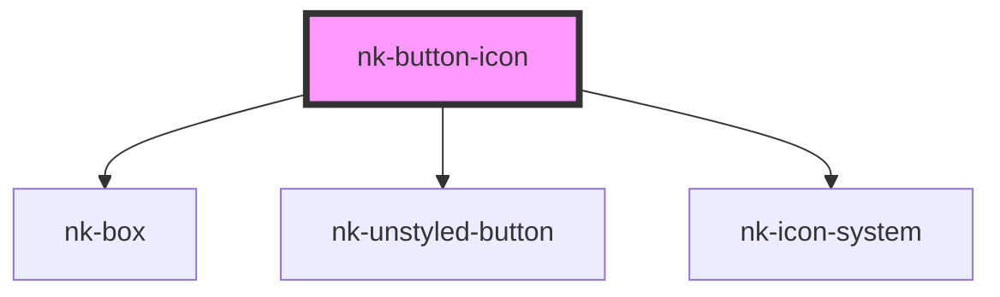

# nk-button-icon

<!-- Auto Generated Below -->

## Properties

| Property   | Attribute  | Description                                              | Type      | Default     |
| ---------- | ---------- | -------------------------------------------------------- | --------- | ----------- |
| `disabled` | `disabled` | Is disabled                                              | `boolean` | `false`     |
| `icon`     | `icon`     | The icon displayed inside of the button                  | `string`  | `undefined` |
| `variant`  | `variant`  | The variant of the button, such as primary and secondary | `string`  | `'primary'` |

## Dependencies

### Depends on

- [nk-box](../box)
- [nk-unstyled-button](../unstyledButton)
- [nk-icon-system](../Icon)

### Graph

----------------------------------------------

*Built with [StencilJS](https://stenciljs.com/)*
