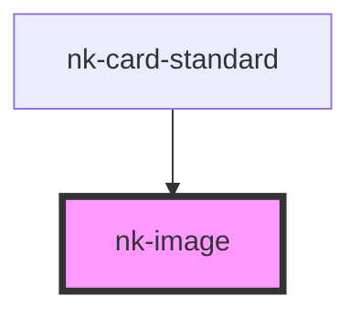

# nk-image

<!-- Auto Generated Below -->

## Properties

| Property  | Attribute | Description                 | Type     | Default     |
| --------- | --------- | --------------------------- | -------- | ----------- |
| `alt`     | `alt`     | The `alt` text of the image | `string` | `undefined` |
| `url`     | `url`     | The image URL of the card   | `string` | `undefined` |
| `variant` | `variant` | Variant of the image        | `string` | `'cover'`   |

## Dependencies

### Used by

 - [nk-card-standard](../card)

### Graph

----------------------------------------------

*Built with [StencilJS](https://stenciljs.com/)*
