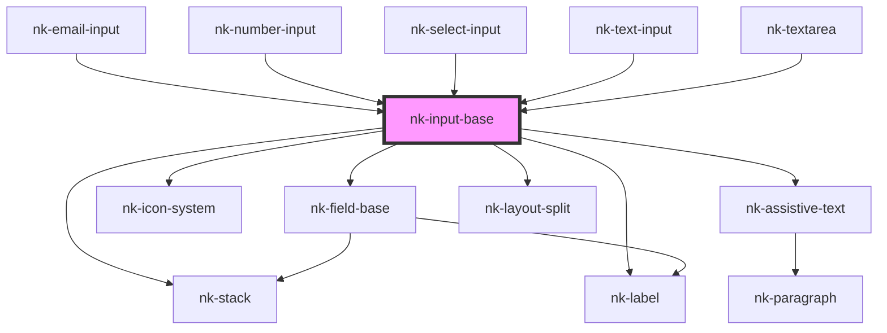

# nk-input-base

<!-- Auto Generated Below -->

## Properties

| Property         | Attribute        | Description                                                  | Type                   | Default     |
| ---------------- | ---------------- | ------------------------------------------------------------ | ---------------------- | ----------- |
| `hasValue`       | `has-value`      | Determines if the label should be raised                     | `boolean`              | `false`     |
| `label`          | `label`          | The label to render. This should be descriptive of the field | `string`               | `''`        |
| `labelassistive` | `labelassistive` | Assistive label which is placed below the input box          | `string`               | `undefined` |
| `state`          | `state`          | Component state. Useful for signaling errors                 | `"default" \| "error"` | `'default'` |
| `variant`        | `variant`        | The variant of the fieldBase element                         | `string`               | `'default'` |
| `width`          | `width`          | Width of the input field in "ch"                             | `number`               | `undefined` |

## Dependencies

### Used by

 - [nk-email-input](../emailInput)
 - [nk-number-input](../numberInput)
 - [nk-select-input](../selectInput)
 - [nk-text-input](../textInput)
 - [nk-textarea](../textarea)

### Depends on

- [nk-stack](../stack)
- [nk-field-base](../fieldBase)
- [nk-icon-system](../Icon)
- [nk-assistive-text](../assistiveText)
- [nk-layout-split](../layoutSplit)
- [nk-label](../label)

### Graph

----------------------------------------------

*Built with [StencilJS](https://stenciljs.com/)*
