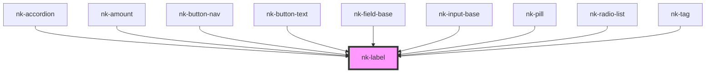

# my-component

<!-- Auto Generated Below -->

## Properties

| Property  | Attribute | Description           | Type     | Default     |
| --------- | --------- | --------------------- | -------- | ----------- |
| `text`    | `text`    | The text of the label | `string` | `undefined` |
| `variant` | `variant` | The label variant     | `string` | `undefined` |

## Dependencies

### Used by

 - [nk-accordion](../accordionItem)
 - [nk-amount](../amount)
 - [nk-button-nav](../navigationButton)
 - [nk-button-text](../button)
 - [nk-field-base](../fieldBase)
 - [nk-input-base](../inputBase)
 - [nk-pill](../pill)
 - [nk-radio-list](../radioDetailedList)
 - [nk-tag](../tag)

### Graph

----------------------------------------------

*Built with [StencilJS](https://stenciljs.com/)*
