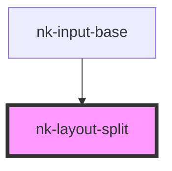

# nk-layout-split

<!-- Auto Generated Below -->

## Dependencies

### Used by

 - [nk-input-base](../inputBase)

### Graph

----------------------------------------------

*Built with [StencilJS](https://stenciljs.com/)*
