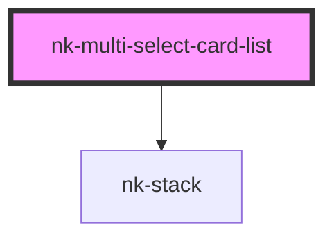

# nk-single-card-list

<!-- Auto Generated Below -->

## Properties

| Property | Attribute | Description                            | Type       | Default |
| -------- | --------- | -------------------------------------- | ---------- | ------- |
| `values` | --        | selected cards containing their cardid | `string[]` | `[]`    |

## Events

| Event         | Description | Type                    |
| ------------- | ----------- | ----------------------- |
| `cardChanged` |             | `CustomEvent<string[]>` |

## Dependencies

### Depends on

- [nk-stack](../stack)

### Graph

----------------------------------------------

*Built with [StencilJS](https://stenciljs.com/)*
