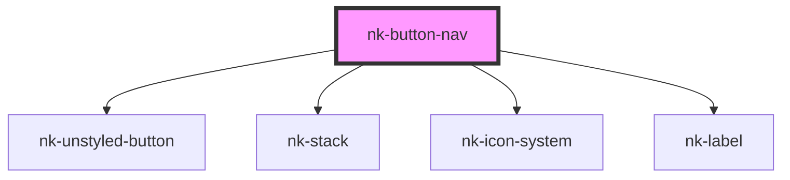

# nk-button-nav

<!-- Auto Generated Below -->

## Properties

| Property   | Attribute  | Description                          | Type                       | Default     |
| ---------- | ---------- | ------------------------------------ | -------------------------- | ----------- |
| `iconname` | `iconname` | Name of the icon to use              | `string`                   | `undefined` |
| `label`    | `label`    | Text of the navigation button label  | `string`                   | `undefined` |
| `variant`  | `variant`  | The variant of the navigation button | `"default" \| "icon-only"` | `'default'` |

## Dependencies

### Depends on

- [nk-unstyled-button](../unstyledButton)
- [nk-stack](../stack)
- [nk-icon-system](../Icon)
- [nk-label](../label)

### Graph

----------------------------------------------

*Built with [StencilJS](https://stenciljs.com/)*
