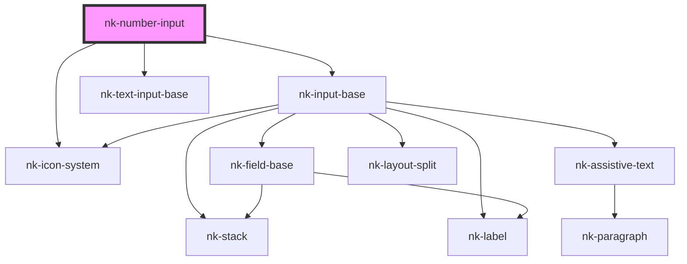

# nk-number-input

<!-- Auto Generated Below -->

## Properties

| Property    | Attribute    | Description                               | Type      | Default     |
| ----------- | ------------ | ----------------------------------------- | --------- | ----------- |
| `disabled`  | `disabled`   | Determines if the text field is read only | `boolean` | `false`     |
| `label`     | `label`      | The label shown above the input field     | `string`  | `undefined` |
| `max`       | `max`        | Maximum numerical value                   | `string`  | `undefined` |
| `maxLength` | `max-length` | Max length of the input string            | `string`  | `undefined` |
| `min`       | `min`        | Minimum numerical value                   | `string`  | `undefined` |
| `value`     | `value`      | The value in the input field              | `number`  | `null`      |
| `variant`   | `variant`    | The variant of the fieldBase element      | `string`  | `'default'` |
| `width`     | `width`      | Width of the field in 'ch'                | `number`  | `undefined` |

## Events

| Event          | Description | Type                  |
| -------------- | ----------- | --------------------- |
| `valueChanged` |             | `CustomEvent<number>` |

## Dependencies

### Depends on

- [nk-input-base](../inputBase)
- [nk-icon-system](../Icon)
- [nk-text-input-base](../textInputBase)

### Graph

----------------------------------------------

*Built with [StencilJS](https://stenciljs.com/)*
