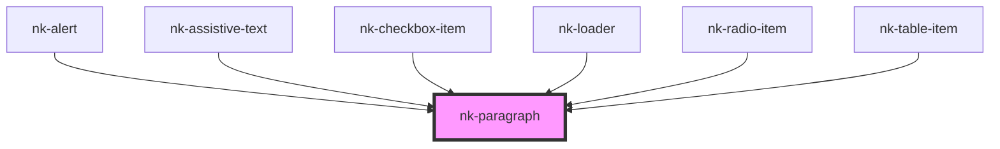

# my-component

<!-- Auto Generated Below -->

## Properties

| Property    | Attribute   | Description                           | Type                                                                                                                                        | Default     |
| ----------- | ----------- | ------------------------------------- | ------------------------------------------------------------------------------------------------------------------------------------------- | ----------- |
| `alignment` | `alignment` | Text alignment for the paragraph      | `"center" \| "left" \| "right"`                                                                                                             | `'left'`    |
| `text`      | `text`      | The text to display in the paragraph. | `string`                                                                                                                                    | `undefined` |
| `unsafe`    | `unsafe`    | Allows for direct HTML injection      | `boolean`                                                                                                                                   | `false`     |
| `variant`   | `variant`   | The paragraph variant                 | `"assistive" \| "assistive-emphasis" \| "body" \| "body-emphasis" \| "body-secondary" \| "body-secondary-emphasis" \| "legal" \| "manchet"` | `undefined` |

## Dependencies

### Used by

 - [nk-alert](../alert)
 - [nk-assistive-text](../assistiveText)
 - [nk-checkbox-item](../checkboxDetailed)
 - [nk-loader](../loadingBar)
 - [nk-radio-item](../radioDetailed)
 - [nk-table-item](../dataDefinitionItem)

### Graph

----------------------------------------------

*Built with [StencilJS](https://stenciljs.com/)*
