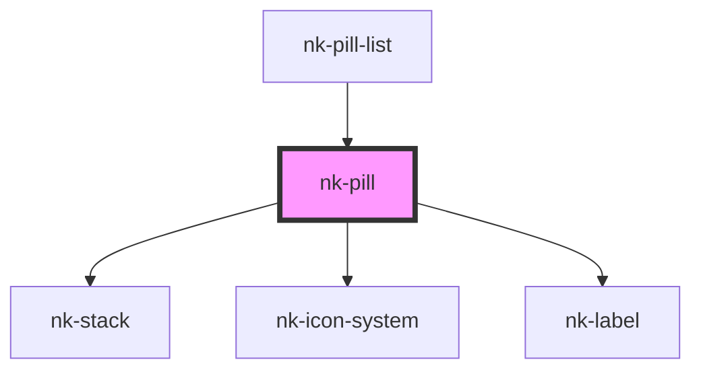

# nk-pill

<!-- Auto Generated Below -->

## Properties

| Property   | Attribute  | Description            | Type      | Default     |
| ---------- | ---------- | ---------------------- | --------- | ----------- |
| `disabled` | `disabled` | Is this pill disabled? | `boolean` | `false`     |
| `icon`     | `icon`     |                        | `string`  | `undefined` |
| `label`    | `label`    |                        | `string`  | `undefined` |
| `value`    | `value`    | Is checked             | `boolean` | `false`     |

## Events

| Event        | Description | Type                   |
| ------------ | ----------- | ---------------------- |
| `pillChange` |             | `CustomEvent<boolean>` |

## Dependencies

### Used by

 - [nk-pill-list](../pillList)

### Depends on

- [nk-stack](../stack)
- [nk-icon-system](../Icon)
- [nk-label](../label)

### Graph

----------------------------------------------

*Built with [StencilJS](https://stenciljs.com/)*
