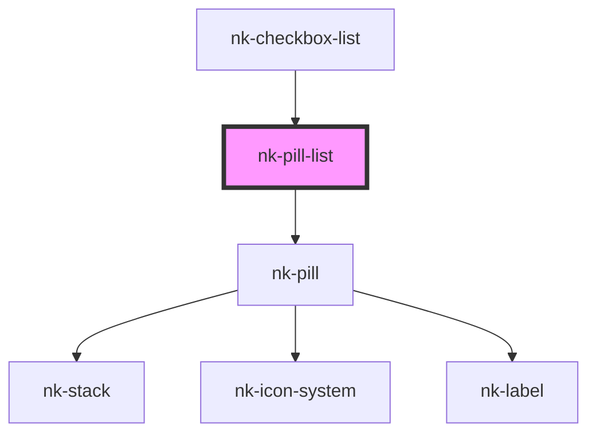

# nk-pill-list

<!-- Auto Generated Below -->

## Properties

| Property  | Attribute | Description | Type           | Default |
| --------- | --------- | ----------- | -------------- | ------- |
| `options` | --        |             | `PillOption[]` | `[]`    |
| `values`  | --        |             | `string[]`     | `[]`    |

## Events

| Event        | Description | Type                    |
| ------------ | ----------- | ----------------------- |
| `pillChange` |             | `CustomEvent<string[]>` |

## Dependencies

### Used by

 - [nk-checkbox-list](../checkboxDetailedList)

### Depends on

- [nk-pill](../pill)

### Graph

----------------------------------------------

*Built with [StencilJS](https://stenciljs.com/)*
