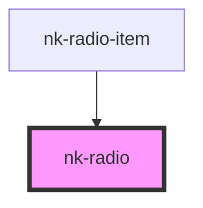

# nk-radio

<!-- Auto Generated Below -->

## Properties

| Property    | Attribute   | Description                                                       | Type      | Default     |
| ----------- | ----------- | ----------------------------------------------------------------- | --------- | ----------- |
| `disabled`  | `disabled`  | Is the radiobutton disabled?                                      | `boolean` | `false`     |
| `hideinput` | `hideinput` | Boolean to tell if input should be displayed in DOM or not        | `boolean` | `false`     |
| `name`      | `name`      | Name of the radiobutton                                           | `string`  | `undefined` |
| `value`     | `value`     | The value of the radiobutton. True if checked, false in unchecked | `boolean` | `false`     |

## Events

| Event          | Description | Type                   |
| -------------- | ----------- | ---------------------- |
| `valueChanged` |             | `CustomEvent<boolean>` |

## Dependencies

### Used by

 - [nk-radio-item](../radioDetailed)

### Graph

----------------------------------------------

*Built with [StencilJS](https://stenciljs.com/)*
