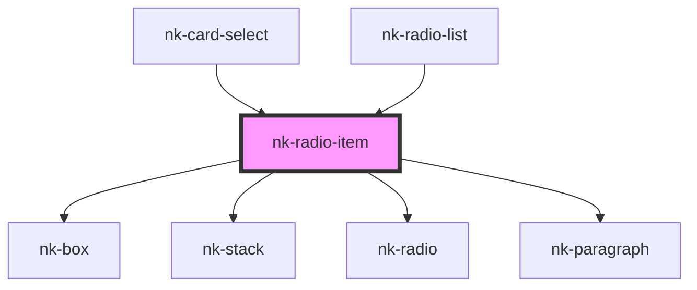

# nk-radio-detailed

<!-- Auto Generated Below -->

## Properties

| Property     | Attribute    | Description                                                | Type        | Default     |
| ------------ | ------------ | ---------------------------------------------------------- | ----------- | ----------- |
| `buttonid`   | `buttonid`   | The id of the radiobutton                                  | `string`    | `undefined` |
| `disabled`   | `disabled`   | Determines if the radio button is disabled                 | `boolean`   | `false`     |
| `hideinput`  | `hideinput`  | Boolean to tell if input should be displayed in DOM or not | `boolean`   | `undefined` |
| `label`      | `label`      | The label shown next to the radio button                   | `string`    | `undefined` |
| `name`       | `name`       | Name of the radiobutton                                    | `string`    | `undefined` |
| `titlelabel` | `titlelabel` | The emphasized text above the label                        | `string`    | `undefined` |
| `value`      | `value`      | The value of the radio button                              | `boolean`   | `undefined` |
| `variant`    | `variant`    | The variant of the radiobutton with label component        | `"default"` | `'default'` |

## Events

| Event          | Description | Type                   |
| -------------- | ----------- | ---------------------- |
| `valueChanged` |             | `CustomEvent<boolean>` |

## Dependencies

### Used by

 - [nk-card-select](../cardSelect)
 - [nk-radio-list](../radioDetailedList)

### Depends on

- [nk-box](../box)
- [nk-stack](../stack)
- [nk-radio](../radio)
- [nk-paragraph](../paragraph)

### Graph

----------------------------------------------

*Built with [StencilJS](https://stenciljs.com/)*
