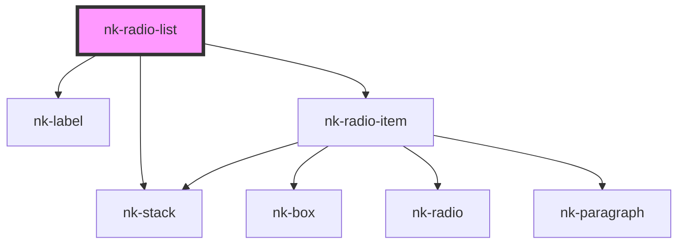

# nk-radio-detailed-list

<!-- Auto Generated Below -->

## Properties

| Property       | Attribute     | Description                                                | Type                          | Default      |
| -------------- | ------------- | ---------------------------------------------------------- | ----------------------------- | ------------ |
| `groupname`    | `groupname`   | The name of the radiobutton group                          | `string`                      | `undefined`  |
| `label`        | `label`       | The label to show above the list of radiobuttons           | `string`                      | `undefined`  |
| `orientation`  | `orientation` | Orientation of the radio button list. Defaults to vertical | `"horizontal" \| "vertical"`  | `'vertical'` |
| `radiobuttons` | --            |                                                            | `RadioButtonWithLabelProps[]` | `[]`         |
| `value`        | `value`       | The id of the currently chosen radiobutton                 | `string`                      | `undefined`  |

## Events

| Event          | Description | Type                  |
| -------------- | ----------- | --------------------- |
| `valueChanged` |             | `CustomEvent<string>` |

## Dependencies

### Depends on

- [nk-label](../label)
- [nk-stack](../stack)
- [nk-radio-item](../radioDetailed)

### Graph

----------------------------------------------

*Built with [StencilJS](https://stenciljs.com/)*
