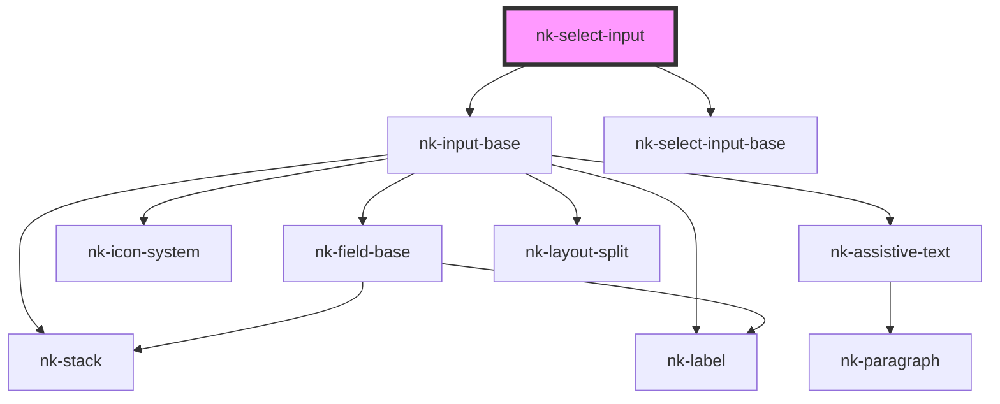

# nk-select-input

<!-- Auto Generated Below -->

## Properties

| Property  | Attribute | Description                                                             | Type                 | Default     |
| --------- | --------- | ----------------------------------------------------------------------- | -------------------- | ----------- |
| `label`   | `label`   | Label to be displayed above the select                                  | `string`             | `undefined` |
| `options` | --        | Possible options to select from                                         | `SelectInputValue[]` | `undefined` |
| `value`   | `value`   | The selected value. This should match the value of an object in Options | `number \| string`   | `undefined` |
| `variant` | `variant` | The variant of the fieldBase element                                    | `string`             | `'default'` |
| `width`   | `width`   | Width of the field in 'ch'                                              | `number`             | `undefined` |

## Events

| Event          | Description | Type                            |
| -------------- | ----------- | ------------------------------- |
| `valueChanged` |             | `CustomEvent<number \| string>` |

## Dependencies

### Depends on

- [nk-input-base](../inputBase)
- [nk-select-input-base](../selectInputBase)

### Graph

----------------------------------------------

*Built with [StencilJS](https://stenciljs.com/)*
