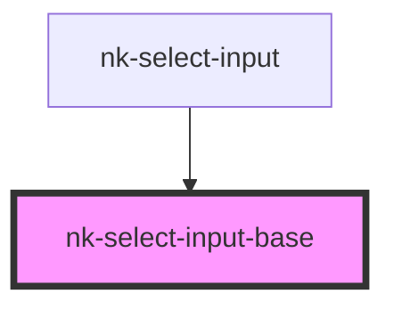

# nk-select-input-base

<!-- Auto Generated Below -->

## Properties

| Property  | Attribute | Description               | Type                 | Default     |
| --------- | --------- | ------------------------- | -------------------- | ----------- |
| `options` | --        | Allowed values            | `SelectInputValue[]` | `[]`        |
| `value`   | `value`   | Value of the select input | `string`             | `undefined` |

## Events

| Event          | Description | Type                  |
| -------------- | ----------- | --------------------- |
| `valueChanged` |             | `CustomEvent<string>` |

## Dependencies

### Used by

 - [nk-select-input](../selectInput)

### Graph

----------------------------------------------

*Built with [StencilJS](https://stenciljs.com/)*
