# nk-stack

<!-- Auto Generated Below -->

## Properties

| Property        | Attribute       | Description                                          | Type                                     | Default      |
| --------------- | --------------- | ---------------------------------------------------- | ---------------------------------------- | ------------ |
| `alignment`     | `alignment`     | Dictates the aligment of the stack                   | `"center" \| "end" \| "none" \| "start"` | `'none'`     |
| `justification` | `justification` | Dictates justification of the stack items            | `"end" \| "none" \| "space-between"`     | `'none'`     |
| `orientation`   | `orientation`   | Dictates the orientation of the stack                | `"horizontal" \| "vertical"`             | `'vertical'` |
| `variant`       | `variant`       | Dictates the spacing and contextual use of the stack | `string`                                 | `undefined`  |
| `wrap`          | `wrap`          | Disable wrap                                         | `"nowrap" \| "wrap"`                     | `'wrap'`     |

## Dependencies

### Used by

 - [nk-accordion](../accordionItem)
 - [nk-alert](../alert)
 - [nk-amount](../amount)
 - [nk-button-nav](../navigationButton)
 - [nk-button-text](../button)
 - [nk-canvas-button](../canvasButton)
 - [nk-card-select](../cardSelect)
 - [nk-checkbox-item](../checkboxDetailed)
 - [nk-checkbox-list](../checkboxDetailedList)
 - [nk-field-base](../fieldBase)
 - [nk-input-base](../inputBase)
 - [nk-list-unordered](../unorderedList)
 - [nk-loader](../loadingBar)
 - [nk-multi-select-card-list](../multiSelectCardList)
 - [nk-pill](../pill)
 - [nk-radio-item](../radioDetailed)
 - [nk-radio-list](../radioDetailedList)
 - [nk-single-select-card-list](../singleSelectCardList)
 - [nk-stepper-item](../flowStepperItem)
 - [nk-stepper-list](../flowStepperList)
 - [nk-table-item](../dataDefinitionItem)
 - [nk-table-list](../dataDefinitionList)
 - [nk-tag](../tag)
 - [nk-tag-list](../tagStack)

### Graph

```mermaid
graph TD;
  nk-accordion --> nk-stack
  nk-alert --> nk-stack
  nk-amount --> nk-stack
  nk-button-nav --> nk-stack
  nk-button-text --> nk-stack
  nk-canvas-button --> nk-stack
  nk-card-select --> nk-stack
  nk-checkbox-item --> nk-stack
  nk-checkbox-list --> nk-stack
  nk-field-base --> nk-stack
  nk-input-base --> nk-stack
  nk-list-unordered --> nk-stack
  nk-loader --> nk-stack
  nk-multi-select-card-list --> nk-stack
  nk-pill --> nk-stack
  nk-radio-item --> nk-stack
  nk-radio-list --> nk-stack
  nk-single-select-card-list --> nk-stack
  nk-stepper-item --> nk-stack
  nk-stepper-list --> nk-stack
  nk-table-item --> nk-stack
  nk-table-list --> nk-stack
  nk-tag --> nk-stack
  nk-tag-list --> nk-stack
  style nk-stack fill:#f9f,stroke:#333,stroke-width:4px
```

----------------------------------------------

*Built with [StencilJS](https://stenciljs.com/)*
