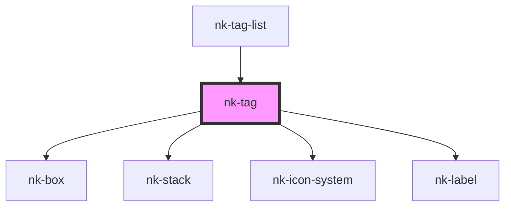

# nk-tag

<!-- Auto Generated Below -->

## Properties

| Property | Attribute | Description                | Type     | Default     |
| -------- | --------- | -------------------------- | -------- | ----------- |
| `icon`   | `icon`    | Optional icon name         | `string` | `undefined` |
| `text`   | `text`    | The text that is displayed | `string` | `undefined` |

## Dependencies

### Used by

 - [nk-tag-list](../tagStack)

### Depends on

- [nk-box](../box)
- [nk-stack](../stack)
- [nk-icon-system](../Icon)
- [nk-label](../label)

### Graph

----------------------------------------------

*Built with [StencilJS](https://stenciljs.com/)*
