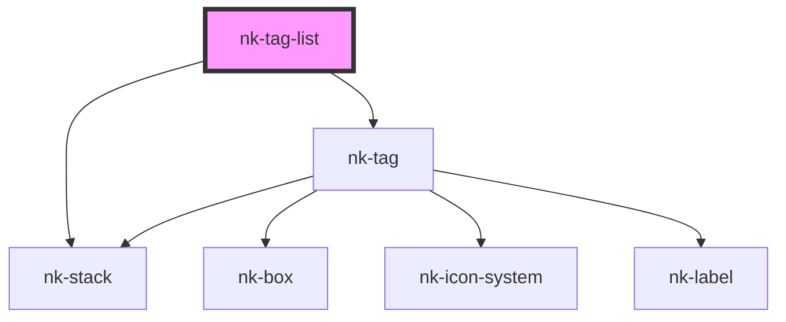

# nk-tag-list

<!-- Auto Generated Below -->

## Properties

| Property  | Attribute | Description              | Type                         | Default        |
| --------- | --------- | ------------------------ | ---------------------------- | -------------- |
| `tags`    | --        | List of tags             | `TagProps[]`                 | `[]`           |
| `variant` | `variant` | Variant of the tag stack | `"horizontal" \| "vertical"` | `'horizontal'` |

## Dependencies

### Depends on

- [nk-stack](../stack)
- [nk-tag](../tag)

### Graph

----------------------------------------------

*Built with [StencilJS](https://stenciljs.com/)*
