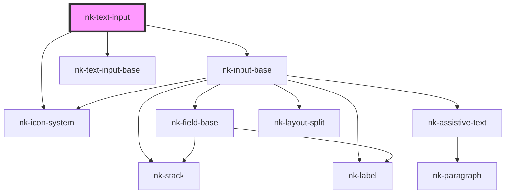

# nk-text-input

<!-- Auto Generated Below -->

## Properties

| Property             | Attribute            | Description                                                                             | Type      | Default     |
| -------------------- | -------------------- | --------------------------------------------------------------------------------------- | --------- | ----------- |
| `customerrormessage` | `customerrormessage` | Custom error message                                                                    | `string`  | `undefined` |
| `disabled`           | `disabled`           | Determines if the text field is read only                                               | `boolean` | `false`     |
| `issearchable`       | `issearchable`       | Determines if the text input is used a search input. If true it will show a search icon | `boolean` | `undefined` |
| `label`              | `label`              | The label shown above the input field                                                   | `string`  | `''`        |
| `maxLength`          | `max-length`         | Max length of the input string                                                          | `string`  | `undefined` |
| `pattern`            | `pattern`            | Regex pattern for HTML5 validation                                                      | `string`  | `undefined` |
| `required`           | `required`           | Required                                                                                | `boolean` | `false`     |
| `value`              | `value`              | The value of the input field                                                            | `string`  | `''`        |
| `variant`            | `variant`            | The variant of the fieldBase element                                                    | `string`  | `'default'` |
| `width`              | `width`              | Width of the field in 'ch'                                                              | `number`  | `undefined` |

## Events

| Event          | Description | Type                  |
| -------------- | ----------- | --------------------- |
| `valueChanged` |             | `CustomEvent<string>` |

## Dependencies

### Depends on

- [nk-input-base](../inputBase)
- [nk-icon-system](../Icon)
- [nk-text-input-base](../textInputBase)

### Graph

----------------------------------------------

*Built with [StencilJS](https://stenciljs.com/)*
