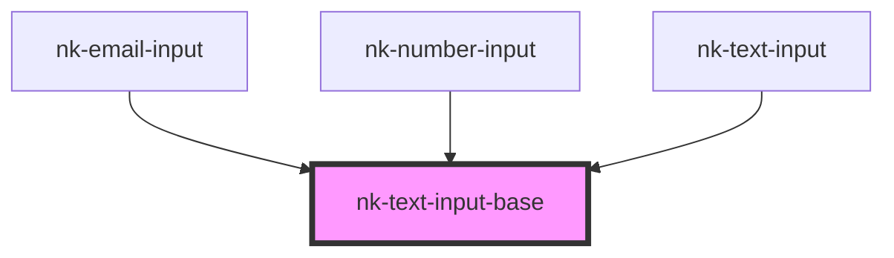

# nk-text-input-base

<!-- Auto Generated Below -->

## Properties

| Property             | Attribute            | Description                                | Type                                                                                                                                                                                            | Default     |
| -------------------- | -------------------- | ------------------------------------------ | ----------------------------------------------------------------------------------------------------------------------------------------------------------------------------------------------- | ----------- |
| `customerrormessage` | `customerrormessage` | Custom error message                       | `string`                                                                                                                                                                                        | `undefined` |
| `disabled`           | `disabled`           | Disables input if true.                    | `boolean`                                                                                                                                                                                       | `false`     |
| `inputMode`          | `input-mode`         |                                            | `string`                                                                                                                                                                                        | `undefined` |
| `max`                | `max`                | Maximum value of the input                 | `string`                                                                                                                                                                                        | `undefined` |
| `maxLength`          | `max-length`         | Maximum allowed length of the input string | `string`                                                                                                                                                                                        | `undefined` |
| `min`                | `min`                | Minimum value of the input                 | `string`                                                                                                                                                                                        | `undefined` |
| `pattern`            | `pattern`            | Regex pattern for HTML5 validation         | `string`                                                                                                                                                                                        | `undefined` |
| `required`           | `required`           | Required                                   | `boolean`                                                                                                                                                                                       | `undefined` |
| `type`               | `type`               | The type of the HTMLInputField             | `"button" \| "checkbox" \| "color" \| "date" \| "email" \| "file" \| "hidden" \| "image" \| "number" \| "password" \| "radio" \| "range" \| "reset" \| "search" \| "submit" \| "text" \| "url"` | `'text'`    |
| `value`              | `value`              | The value of the input field               | `Date \| string`                                                                                                                                                                                | `undefined` |

## Events

| Event          | Description | Type                                                                         |
| -------------- | ----------- | ---------------------------------------------------------------------------- |
| `validChanged` |             | `CustomEvent<{ isValid: boolean; value: string \| Date; message: string; }>` |
| `valueChanged` |             | `CustomEvent<string>`                                                        |

## Dependencies

### Used by

 - [nk-email-input](../emailInput)
 - [nk-number-input](../numberInput)
 - [nk-text-input](../textInput)

### Graph

----------------------------------------------

*Built with [StencilJS](https://stenciljs.com/)*
