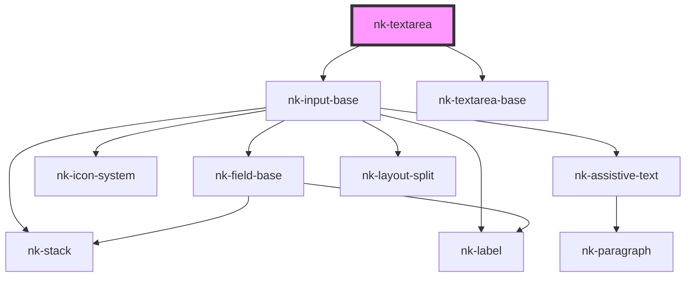

# nk-text-area

<!-- Auto Generated Below -->

## Properties

| Property          | Attribute          | Description                          | Type      | Default     |
| ----------------- | ------------------ | ------------------------------------ | --------- | ----------- |
| `disabled`        | `disabled`         | Disables input if true.              | `boolean` | `false`     |
| `label`           | `label`            | Description of this property         | `string`  | `undefined` |
| `maxLength`       | `max-length`       | Maximum length of the value string   | `string`  | `undefined` |
| `placeholderText` | `placeholder-text` |                                      | `string`  | `undefined` |
| `value`           | `value`            | The text value within the textarea   | `string`  | `undefined` |
| `variant`         | `variant`          | The variant of the fieldBase element | `string`  | `'default'` |

## Events

| Event          | Description | Type                  |
| -------------- | ----------- | --------------------- |
| `valueChanged` |             | `CustomEvent<string>` |

## Dependencies

### Depends on

- [nk-input-base](../inputBase)
- [nk-textarea-base](../textareaBase)

### Graph

----------------------------------------------

*Built with [StencilJS](https://stenciljs.com/)*
