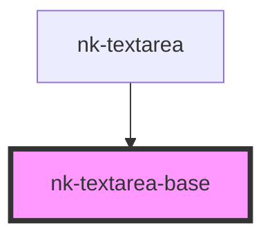

# nk-textarea-base

<!-- Auto Generated Below -->

## Properties

| Property          | Attribute          | Description                    | Type      | Default     |
| ----------------- | ------------------ | ------------------------------ | --------- | ----------- |
| `disabled`        | `disabled`         | Disables input if true.        | `boolean` | `false`     |
| `maxLength`       | `max-length`       | Max length of the value string | `string`  | `undefined` |
| `placeholderText` | `placeholder-text` |                                | `string`  | `undefined` |
| `value`           | `value`            | Text value of the textarea     | `string`  | `undefined` |

## Events

| Event          | Description | Type                  |
| -------------- | ----------- | --------------------- |
| `valueChanged` |             | `CustomEvent<string>` |

## Dependencies

### Used by

 - [nk-textarea](../textarea)

### Graph

----------------------------------------------

*Built with [StencilJS](https://stenciljs.com/)*
