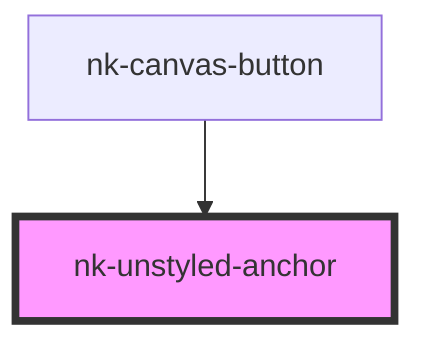

# nk-unstyled-anchor

<!-- Auto Generated Below -->

## Properties

| Property | Attribute | Description                                            | Type      | Default     |
| -------- | --------- | ------------------------------------------------------ | --------- | ----------- |
| `href`   | `href`    | href                                                   | `string`  | `undefined` |
| `inline` | `inline`  | Determine if the anchor is an inline element or block; | `boolean` | `undefined` |
| `target` | `target`  | target                                                 | `"blank"` | `undefined` |

## Dependencies

### Used by

 - [nk-canvas-button](../canvasButton)

### Graph

----------------------------------------------

*Built with [StencilJS](https://stenciljs.com/)*
