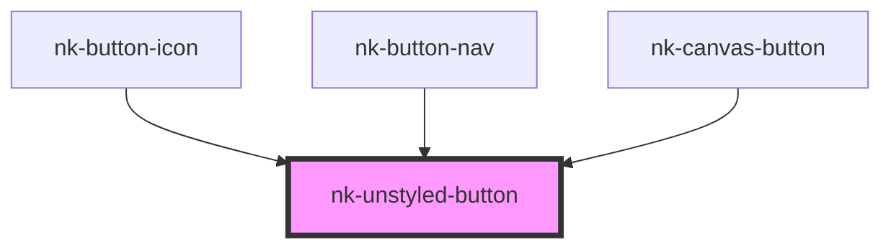

# nk-unstyled-button

<!-- Auto Generated Below -->

## Properties

| Property | Attribute | Description | Type      | Default     |
| -------- | --------- | ----------- | --------- | ----------- |
| `inline` | `inline`  |             | `boolean` | `undefined` |

## Dependencies

### Used by

 - [nk-button-icon](../iconButton)
 - [nk-button-nav](../navigationButton)
 - [nk-canvas-button](../canvasButton)

### Graph

----------------------------------------------

*Built with [StencilJS](https://stenciljs.com/)*
